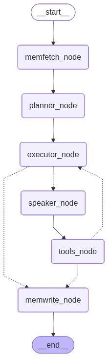

# Atlas AI

A fully local browser AI agent designed to automate complex web workflows. 

**Current MVP Goal:** End-to-end autonomous form filling

---

## 📂 Root Structure

```text
project-atlas/
├── ui/                    # React (Vite) Frontend
├── manager/               # Java (Spring Boot) Backend (Middleware/Routing)
├── core/                  # Python (FastAPI + LangGraph) AI Worker
├── .gitignore
├── integration_guide.md   # MUST-READ for all AI Copilots and Devs
└── README.md
```

# 💻 Frontend Structure (React + TypeScript)

```text
ui/
├── public/
├── src/
│   ├── assets/             # Icons, logos, global CSS
│   ├── components/
│   │   ├── chat/           # ChatWindow.tsx, MessageBubble.tsx
│   │   ├── terminal/       # LiveLogViewer.tsx (For agent thought streams)
│   │   └── shared/         # Buttons, Modals, Inputs
│   ├── hooks/              # Custom React hooks
│   │   └── useWebSocket.ts # Manages STOMP connection to Java backend
│   ├── services/           # External communication
│   │   └── socketClient.ts # STOMP over WebSocket setup
│   ├── App.tsx             # Main layout
│   └── main.tsx
├── index.html
└── package.json
```

# ⚙️ Manager Structure (Java SpringBoot)

```text
manager/
├── pom.xml                 # Dependencies (Spring Web, WebSocket)
└── src/main/java/dev/atlas/
    ├── AtlasApplication.java
    ├── api/                  # REST Controllers & STOMP MessageMappings
    │   └── ChatController.java     # Handles UI prompts & routes to Python
    ├── config/               # System configurations
    │   └── WebSocketConfig.java    # STOMP /topic/chat and /topic/logs
    ├── service/              # Business Logic
    │   └── PythonBridgeClient.java # Async HTTP/WebSocket client connecting to FastAPI
    └── model/                # Data Transfer Objects
        └── WorkflowState.java
```

# 🤖 Core Structure (Python)

```text
core/
├── requirements.txt          # fastapi, uvicorn, langgraph, langchain, playwright
├── main.py                   # FastAPI app init & LangServe streaming routes
├── agent.py                  # LangGraph topology (Nodes, Edges, Workflow Compiler)
├── state.py                  # AgentState (TypedDict) definition
├── browser_manager.py        # Playwright Async Singleton (One browser session ONLY)
├── checkpoints/              # SQLite DBs for LangGraph Thread Checkpointing
├── saves/                    # Local storage for FAISS indices and JSON profiles
├── memory/                   # 4-Way Memory System
│   ├── __init__.py
│   ├── episodic.py           # FAISS: Past successful execution plans
│   ├── factual.py            # JSON: Static user profile data
│   └── semantic.py           # FAISS: Knowledge base and file embeds
└── tools/                    # Granular Agent Capabilities
    ├── __init__.py
    ├── tool_registry.py      # The Master Switchboard (Combines all tools below)
    ├── memory_tools.py       # Active semantic memory saving/searching
    ├── form-input-tools/     # Specific logic for filling inputs, dropdowns, etc.
    │   ├── text_fill.py
    │   └── dropdown_select.py
    └── search-tools/         # Logic for querying search engines
        └── web_search.py
```

# 🕸️ State Graph

